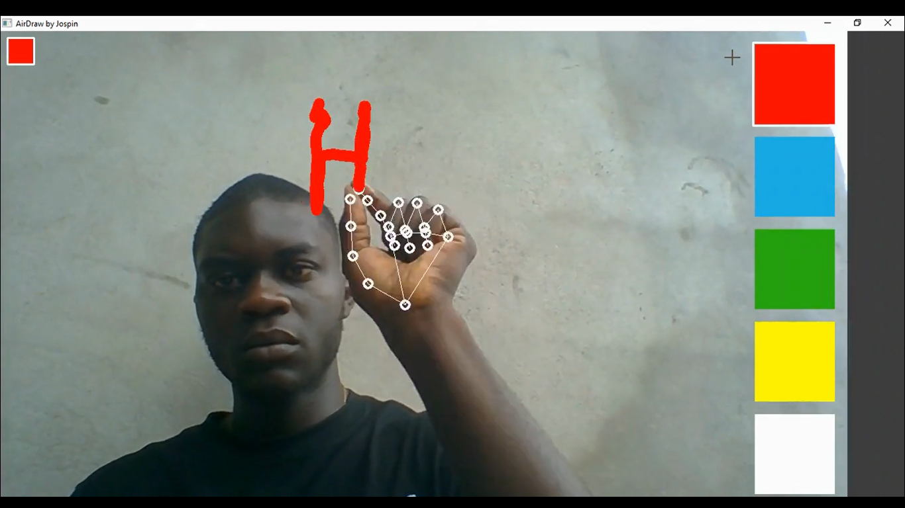

# 🎨 AirDrawJospani by Jospin ✍️

**AirDrawJospani** is a computer vision project that lets you **draw in the air with your fingers**, turning your webcam into a true **interactive digital canvas**. It's inspired by the drawing experience of MS Paint, but here, **no mouse is required** — just your hand. 

---

## 🧾 About

AirDrawJospani relies on cutting-edge technologies to interpret your gestures in real time:

- 🖐️ **MediaPipe**: for precise hand tracking and gesture recognition
- 🖼️ **OpenCV**: for image processing and graphic rendering of drawings
- 🧠 **Computer Vision** techniques: to convert hand movements into intuitive drawing commands

This project illustrates how computer vision can pave the way for **natural interfaces**, where interaction is contactless and creativity is freely expressed.

---

## 🔧 Features

- Real-time hand tracking
- Virtual drawing with the index finger
- Eraser tool and color selection

---

## 🧪 Technologies used

- Python 3.10
- OpenCV
- MediaPipe

---

## 📦 Requirements

- Python 3.10 or later
- Working webcam or camera
---

## 🚀 Installation

### 1. Clone the repository

git clone https://github.com/JospinTchomguim/AirDrawJospani.git  
cd AirDrawJospani

### 2. Create a virtual environment (recommended)

#### Create the virtual environment
python -m venv venv

#### Activate the environment
#### On Windows:
venv\Scripts\activate  
#### On Linux/macOS:
source venv/bin/activate

### 3. Install dependencies
python.exe -m pip install --upgrade pip  
pip install -r requirements.txt

### 4. Launch the application

python src/main.py

## 🖐️ Usage

### ✏️ Drawing gesture
To draw, bring your **index finger and thumb** together to form a pincher. While holding this gesture, **move your hand** in space: this will create lines or shapes on the screen.

### 🎯 Color Selection
Point with your **extended index finger** to the **color palette** located on the right side of the screen to change the brush color.

### 🧽 Erase Gesture
To erase, **fully open your palm**. A **circle will appear around your index finger**, representing the size of the eraser.

---

## 🛠️ Controls and Interface

- 🎨 **Color Palette**: visible on the **right side** of the screen
- 🟢 **Active Color**: displayed in the **top left corner**
- ❌ **Quit App**: press the **`q`** key

Great idea to add a section for planned features! Here's a well-structured version to add to your README.md:

---

## ⏳ Planned Features

Here are some improvements planned for future versions of **AirDrawJospani**:

- 🧰 **Tool Panel**: interface for quickly choosing tools (pen, eraser, shapes, etc.)
- 💾 **Save/Load System**: ability to save your drawings and reopen them later
- 🟦 **Shapes**: addition of basic shapes like rectangles, circles, and straight lines
- ✏️ **Pen Thickness**: adjustment of thickness for more expressive drawing
